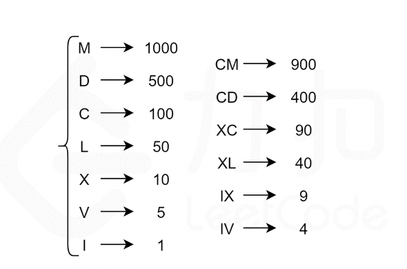

### 题目地址

https://leetcode.cn/problems/integer-to-roman/

### 题目描述

罗马数字包含以下七种字符： I， V， X， L，C，D 和 M。

字符          数值
I             1
V             5
X             10
L             50
C             100
D             500
M             1000

例如， 罗马数字 2 写做 II ，即为两个并列的 1。12 写做 XII ，即为 X + II 。 27 写做  XXVII, 即为 XX + V + II 。

通常情况下，罗马数字中小的数字在大的数字的右边。但也存在特例，例如 4 不写做 IIII，而是 IV。数字 1 在数字 5 的左边，所表示的数等于大数 5 减小数 1 得到的数值 4 。同样地，数字 9 表示为 IX。这个特殊的规则只适用于以下六种情况：

I 可以放在 V (5) 和 X (10) 的左边，来表示 4 和 9。
X 可以放在 L (50) 和 C (100) 的左边，来表示 40 和 90。 
C 可以放在 D (500) 和 M (1000) 的左边，来表示 400 和 900。
给你一个整数，将其转为罗马数字。

**示例1：**

输入: num = 3
输出: "III"

**示例2：**

输入: num = 4
输出: "IV"

**示例3：**

输入: num = 58
输出: "LVIII"
解释: L = 50, V = 5, III = 3.

**示例4：**

输入: num = 1994
输出: "MCMXCIV"
解释: M = 1000, CM = 900, XC = 90, IV = 4.

### 解题思路


根据罗马数字的唯一表示法，为了表示一个给定的整数num，我们寻找不超过num 的最大符号值，将num 减去该符号值，然后继续寻找不超过num 的最大符号值，将该符号拼接在上一个找到的符号之后，循环直至 
num 为 0。最后得到的字符串即为num 的罗马数字表示。

即 所谓的 贪心算法

### 实现代码

``` javascript
/**
 * @param {number} num
 * @return {string}
 */
var intToRoman = function(num) {
    const valueSymbols = [
        [1000, "M"],
        [900, "CM"],
        [500, "D"],
        [400, "CD"],
        [100, "C"],
        [90, "XC"],
        [50, "L"],
        [40, "XL"],
        [10, "X"],
        [9, "IX"],
        [5, "V"],
        [4, "IV"],
        [1, "I"]
    ];

    const roman = []

    for (const [value, symbol] of valueSymbols) {
        while (num >= value) {
            roman.push(symbol)
            num -= value
        }
        if (num === 0) {
            break
        }
    }
    return roman.join('')
};
```